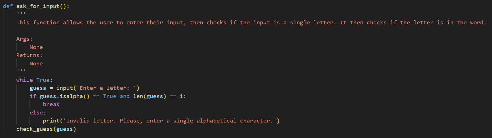

# Hangman
This is a revised version of the classic game of hangman. This one-player game allows the user to play against the computer, where the computer thinks of a word and the user can try to outwit it. The user enters one letter at a time, until they have guessed the chosen word, or lost all their lives.
This game was made in Python.

## 1. Aims
This project was designed to test my new skills in python and git. I was tasked with importing modules, writing code to obtain user input, and writing several functions with different purposes. These functions are outlined in 

## 2. Useage Instructions
Simply download the game file, run it in your terminal, and enjoy the game!

## 3. The Code

### 3.1 Stage 1

- The first stage in this project is obtaining user input, and checking if it's valid. The function used for this is shown below.

- The user input is assigned as the **guess** variable to be parsed throughout the functions. 
- The if statement checks whether the **guess** is alphabetical, and that it is only one letter.
- If the input does not meet this criteria, the user is prompted to enter a new input.

- If the input is valid, the **check_guess()** function is called. The code for this is shown below.
!(check_guess_screenshot.png)
- The word is chosen at random from a list of given words and assigned to the **word** variable.
- The strings are printed to easily and directly show the user if their guess is correct.