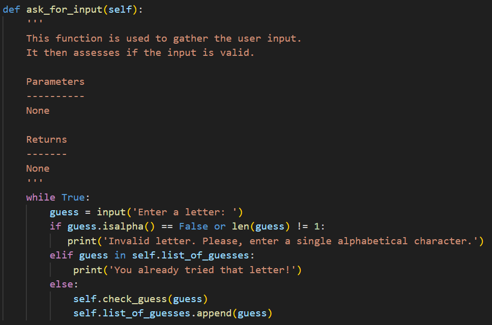
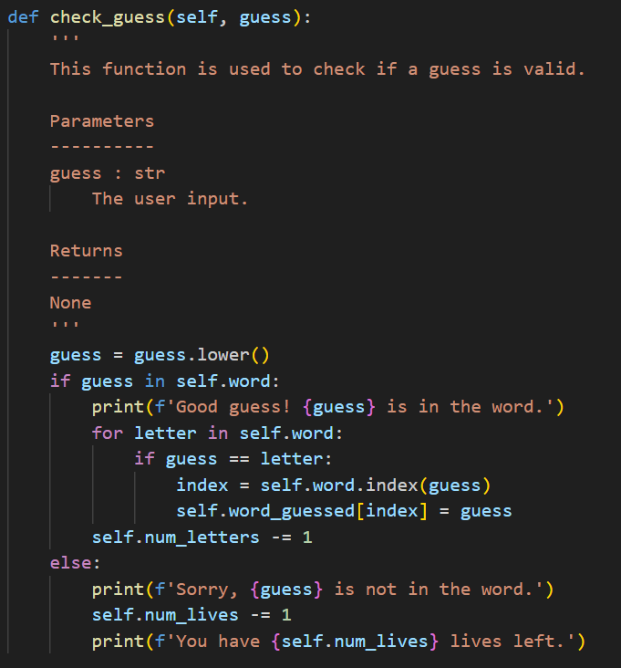

# Hangman

This is a revised version of the classic game of hangman. This one-player game allows the user to play against the computer, where the computer thinks of a word and the user can try to outwit it. The user enters one letter at a time, until they have guessed the chosen word, or lost all their lives.

## Table of Contents
1. Aims
2. Useage Instructions
3. The Code
    1. Initialising the class
    2. check_guess
    3. ask_for_input
    4. play_game

## 1. Aims

This project was designed to test my new skills in python and git. I was tasked with importing modules, writing code to obtain user input, and writing several functions and methods with different purposes. I also put into practise new skills in OOP, by creating the Hangman class. The code behind these features are outlined in Section 3.

## 2. Useage Instructions

Ensure that you have Python3 installed. Simply download the **milestone_5.py** file, run it in your terminal, and enjoy the game!

## 3. The Code

This game was created using OOP in Python. The Hangman class and its attributed and methods are detailed below.

### 3.1. Initialising the class

The class has six attributes, shown below.

- **word_list**: the list of words that might be chosen by the hangman
- **word**: the chosen hangman word
- **word_guessed**: a list of _ as placeholders for the correctly guessed letters
- **num_letters**: numbers of letters left to guess (initially the number of unique letters in **word**)
- **num_lives**: number of lives (default = 5)
- **list_of_guesses**: empty list for guessed letters to be stored in

### 3.2. ask_for_input

- The first stage in this game is obtaining user input, and checking if it's valid. The method used for this is shown below.

- The user input is assigned to the **guess** variable to be parsed throughout the functions.
- The if statement checks whether the **guess** is alphabetical, and that it is only one letter.
- If the input does not meet this criteria, or the user has already tried this letter, the user is prompted to enter a new input.
- If the guess passes both checks,
the **check_guess()** method is called. The code for this is shown below.

### 3.3. check_guess

- The guess is convereted to lower case
- If the guess is correct, the letter is added to the **word_guessed** in place
- If the guess is incorrect, the player loses a life

### 3.4. play_game

- The following function initiates and facilitates gameplay

- The while loop is set to always **True** so that the game runs continuously
- The if block runs when the player has run out of lives, and ends the game with the **break** statement
- The first elif blocks runs initially and continues as long as the game is still running
- The second elif block runs when the player has won the game and ends the game with the **break** statement
